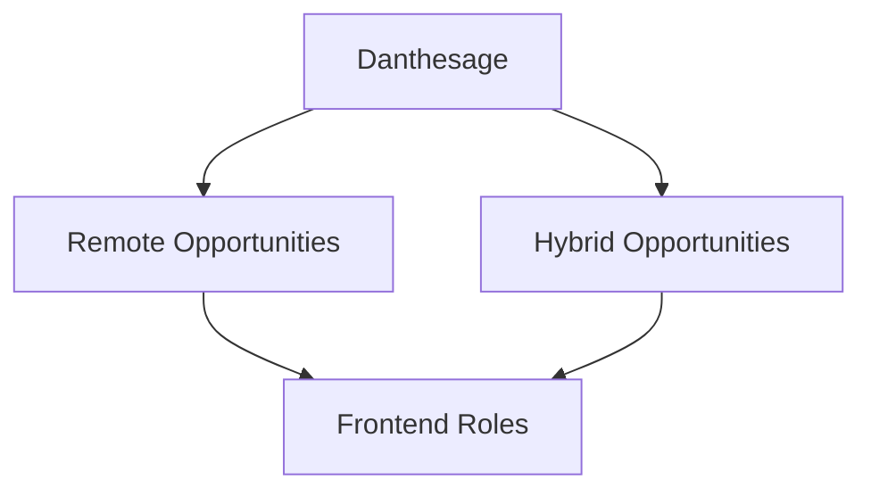

```mermaid
 graph TD;
    A-->B;
    A-->C;
    B-->D;
    C-->D;
```

```mermaid
 graph TD;
   A[Danthesage]-->B[Remote Opportunities];
   A[Danthesage]-->C[Hybrid Opportunities];
   B[Remote Opportunities]-->D[Frontend Roles];
   C[Hybrid Opportunities]-->D[Frontend Roles];
```